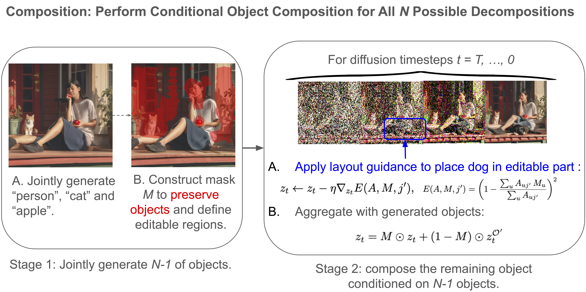
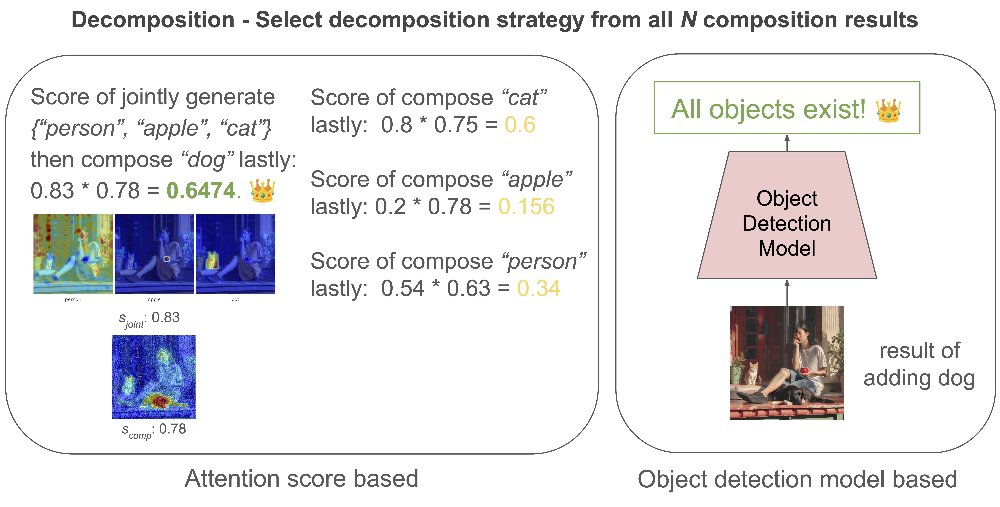

# Training-free Conditional Object Composition for Multi-object Image Generation with Diffusion Models
This repository contains implementations and experiments for conditional composition and guidance methods for Stable Diffusion XL (SDXL). It includes custom SDXL pipeline variants (layout guidance, structure guidance, composable diffusion, attend-and-excite) and evaluation scripts.


## 0. Method Overview

<table align="center">
<tr>
<td width="48%" align="center" valign="middle">

</td>

<td width="4%"></td>

<td width="48%" align="center" valign="middle">

</td>
</tr>
</table>


**Left: Conditional Composition.** We first jointly generate a subset of objects and construct a binary mask from aggregated cross-attention maps to preserve generated regions and define editable regions. The remaining object is then composed using an inpainting-like formulation with layout guidance.

**Right: Decomposition.** We evaluate candidate decompositions and select which object should be generated in the second stage. The attention-based strategy ranks candidates using cross-attention statistics, while the detector-based strategy estimates decomposition quality with an external object detector.
<!-- 
### Conditional Composition


Figure: Illustration of the proposed conditional object composition framework using target object set `{"person", "apple", "cat", "dog"}`. For each possible decomposition, we first jointly generate `N-1` objects and construct a binary mask from aggregated cross-attention maps to preserve generated regions and define editable regions. The remaining object is then composed using an inpainting-like formulation with layout guidance.

### Decomposition


Figure: Illustration of the decomposition process. We evaluate possible decompositions by selecting one object to be generated in the second stage. The attention-based strategy ranks candidates using cross-attention statistics, while the detector-based strategy estimates decomposition quality with an external object detector. -->


## 1. Environment setup

### Package installation
```bash
# Create environment

conda create -n condcomp python=3.10

conda activate condcomp

# Install PyTorch

pip install torch==2.1.2 torchvision==0.16.2 torchaudio==2.1.2

# Install project dependencies

pip install -r requirements.txt
```

### Download model checkpoints

Required checkpoints:

- `ckpts/sdxl/sd_xl_base_1.0.safetensors` (SDXL)
- `ckpts/yolo/yolo11l.pt` (YOLO)

Or pass explicit paths to scripts using `--sdxl_ckpt` and `--yolo_ckpt`.

Quick setup:

```bash
# create dirs
mkdir -p ckpts/sdxl ckpts/yolo

# copy local files
cp /path/to/sd_xl_base_1.0.safetensors ckpts/sdxl/
cp /path/to/yolo11l.pt ckpts/yolo/

# or download (replace <URL> with your source)
wget -O ckpts/sdxl/sd_xl_base_1.0.safetensors <SDXL_BASE_DOWNLOAD_URL>
wget -O ckpts/yolo/yolo11l.pt <YOLO_WEIGHTS_URL>
```

### Download MS COCO Annotaions
Download the [COCO 2014 instances annotations](https://cocodataset.org/#download) (used to build caption/object splits) and place the JSON at the repo root.
Or pass its path with `--coco_instances_json`.

```bash
# copy local COCO instances json
cp /path/to/instances_val2014.json ./instances_val2014.json

# or download (replace <URL> with your source)
wget -O instances_val2014.json <COCO_INSTANCES_VAL2014_JSON_URL>
```

## 2. Run the experiments (Image Generation Using COCO Annotations)

The main driver script for generating images is `sdxl_sample.py`. It supports multiple pipeline modes and distributed execution. Basic single-node example:

```bash
# Example: generate 10 images using layout guidance SDXL (explicit SDXL checkpoint)
python sdxl_sample.py \
  --sdxl_ckpt ./ckpts/sdxl/sd_xl_base_1.0.safetensors \
  --out_dir /path/to/output_dir \
  --layout_guidance_sdxl \
  --class_count 2 
```

Key flags (see `sdxl_sample.py` for full list):
- `--compose_sdxl`, `--layout_guidance_sdxl`, `--structure_guidance_sdxl`, `--attend_and_excite_sdxl`, `--condComp` — choose pipeline variant.
- `--class_count` — number of object categories to sample per image (used when loading COCO filtered captions).
- `--seed` — random seed.

If you want to run distributed generation across multiple GPUs, use `accelerate` or the project's distributed wrapper; `sdxl_sample.py` uses `accelerate.PartialState` to determine per-process behavior.

### Example accelerate scripts

The repo includes example launcher scripts that wrap `sdxl_sample.py` for common configurations. See `scripts/img_sample/` — e.g.: `compose_sdxl.sh`, `layout_guidance_sdxl.sh`, `structure_guidance_sdxl.sh`, `attend_and_excite_sdxl.sh`, `condComp.sh`.

Run an example script:

```bash
bash scripts/img_sample/layout_guidance_sdxl.sh
```

## 3. Evaluation

Run YOLO-based object presence evaluation (compare detections vs expected COCO objects):

```bash
python obj_eval/yolo_detect_objects.py \
  --yolo_ckpt ./ckpts/yolo/yolo11l.pt \
  --img_dir /path/to/generated/imgs \
  --coco_instances_json /path/to/instances_val2014.json \
  --out_json_path /path/to/output/JSON
```

Example evaluation scripts

The repository includes wrapper scripts under `scripts/eval/`:

```bash
bash scripts/eval/yolo_detect.sh
```

Output: writes per-image detection JSON (`eval_results.json`) and prints success rate.

## 4. Limitations

1. Composition quality is not always ideal: newly added objects may appear partially generated, and their placement can be spatially unnatural in some cases.
2. In our experiments, it requires approximately 3x--6x longer inference time than single-stage methods such as Attend-and-Excite.


## 5. Demo

Please refer to `demo.ipynb` for a step-by-step demonstration of the proposed method.

